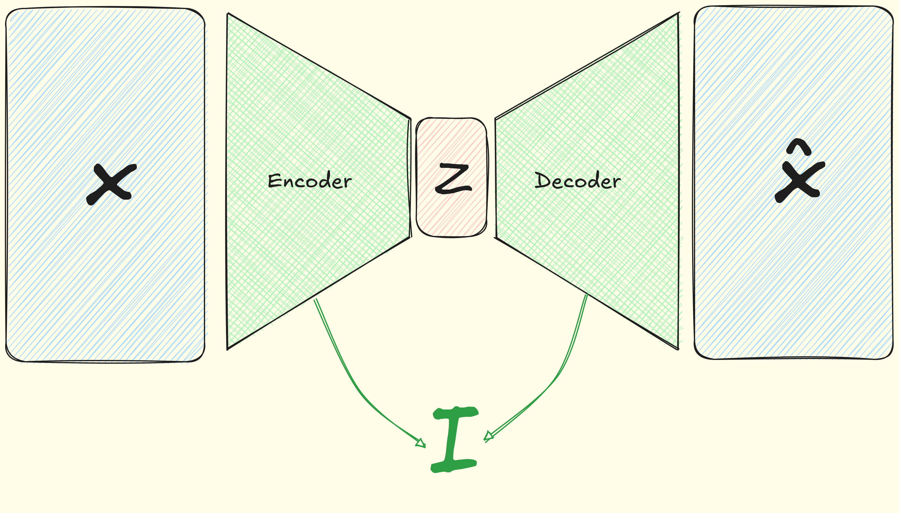
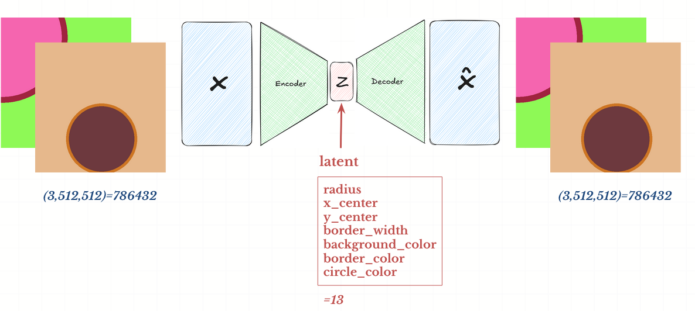
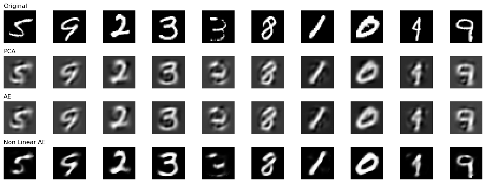
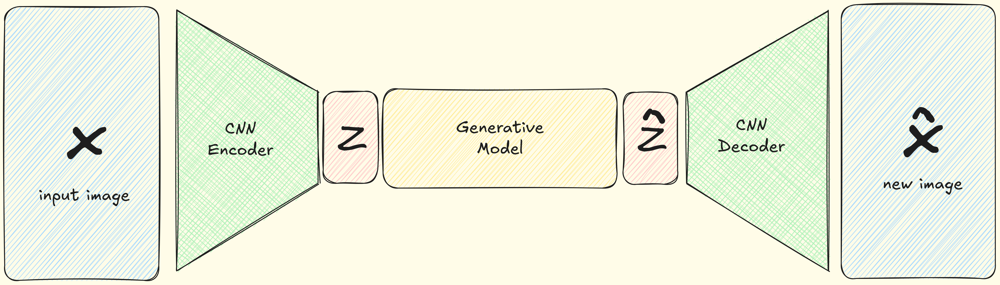
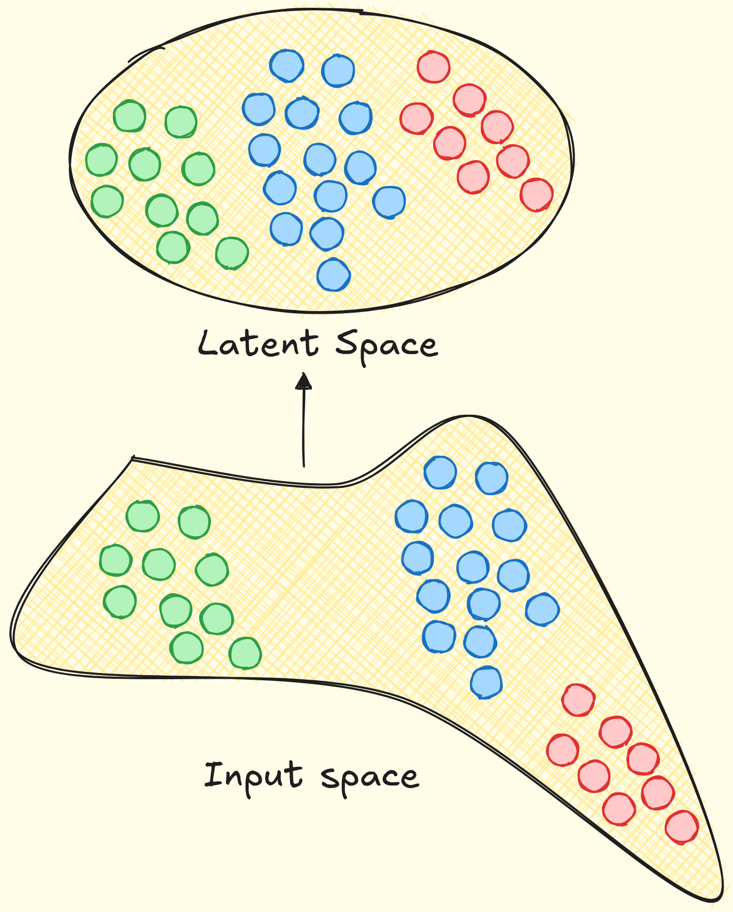
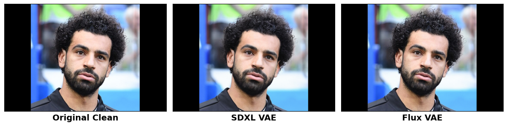
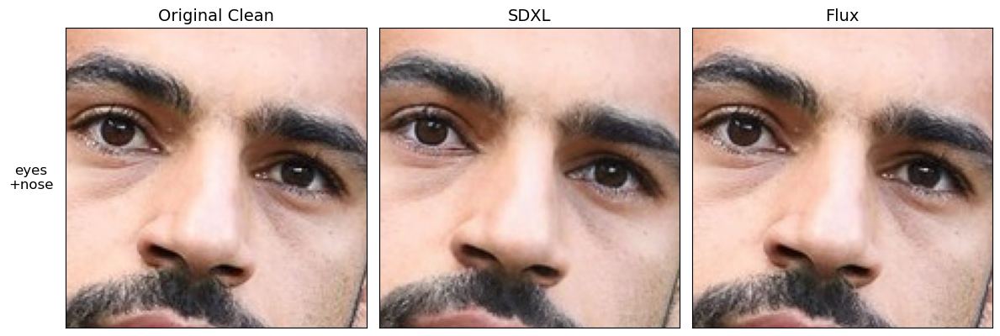
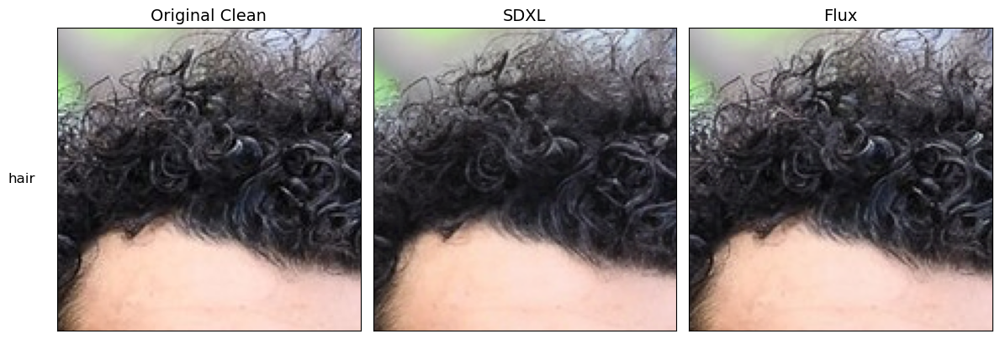

# Auto encoder and Variational Auto Encoder exploration

this code used for two main reasons
1. prepare images to explain autoencoder for my master class 
2. explore different architectures from books `Hands on Machine learning second version chapter 17`

## MY AI Workflow ^ Ethics

>note the code for notebook 0,2 generated using `Gemini 3 Pro` and `Cursor`

>readme written by hand with no refine using AI except in folder structure

since I believe now we need to explore and try more by code rather than study and write by our hand

**Other than that, I commit to not use AI in other areas**

1. complex logic code _(I ask myself if I wrote this code on old project would I copy it? if answer is no then I consider it complex)_ 

2. learning purposes _(When I explore things for first-time using AI; I tend to neglect many important details)_

3. College Lab/Projects that are not permitted to use AI in it _It Just Main ethics_

## AutoEncoder

autoencoder is simply neural network try to learn two things
1. how to compress input into lower dimension space  
2. and then how to decompress and return it 

kinda learn to be a zip program, or Identity Function :XD

`latent` is the name given for the input converted to lower dimension $z$ 

for example if our Dataset is images of different circles then our `latent` 
\
be vector of $z= [\text{radius}, x_\text{center}, y_\text{center}, ...]$

### Difference between AE and PCA

actually if our AE have no `nonlinear activation fn` then AE will be same as PCA

    

        
         
        <em>Comparison between PCA, linear AutoEncoder, non-linear AutoEncoder, showing reconstruction quality.</em>
         
        <em>Latent dimension = PCA components = 32,</em>
         
        <em>Learning rate = 1e-3 / Number epochs = 30.</em>
    

## VAE Comparison
Nowadays, VAEs using inside popular image generation pipelines like `Stable diffusion`, `FLUX`, `Midjourney` etc..., for comperessing images **NOT for Generating Images**

and you can think if useage into two ways
1. why generating image in larger dimension ? if  I can use its latent
2. most of this famous pipelines use "Generative module" that are using sampling in space.
    
    If they sample from (eg., 512*512*3=786432) high dimensional space they are likely to get white noise; Since this space is huge and most images concenterated in some areas with vast space between each other

    

    in reverse if they sampled from latent space where are beside each other
    this called `Mainfold Theory`

between SDXL, FLUX VAE inside their pipeline

conde to generate images is inside `nbs/1_compare_between_vaes.ipynb`

## Folder structure
- `nbs/`: Jupyter notebooks for exploring autoencoders and variational autoencoders.
- `images/`: Sample images used by the notebooks and reports.

**Notebooks**
1. `nbs/0_make_circles_dataset.ipynb`: Basic code to generate circle images for presentation.
1. `nbs/1_compare_between_vaes.ipynb`: Compare between SDXL and Flux VAEs reconstruction on mohamed salah image.
1. `nbs/2_explore_auto_encoders.ipynb`: Explore basic autoencoder architectures and how they reconstruct images on  `MINST`.
1. `nbs/3_explore_auto_encoders_cifar.ipynb`: Train and analyze autoencoders on the `CIFAR10`.
